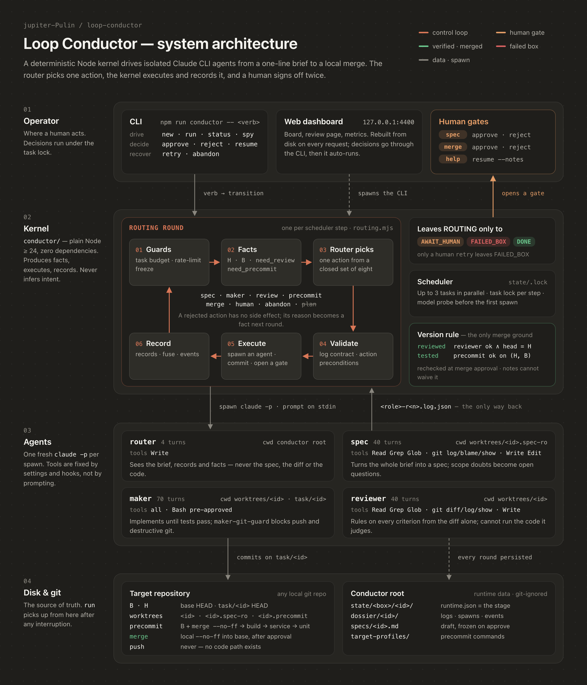
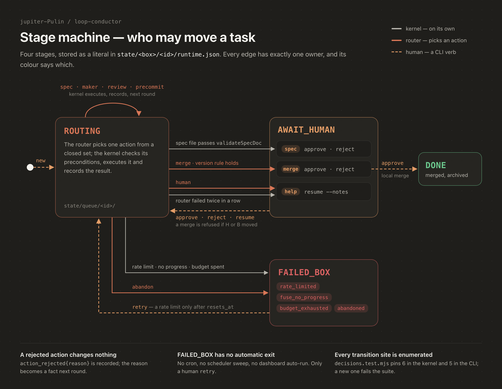

# Loop Conductor

A minimal kernel that runs an agent loop end to end: a **router agent** owns the task — it reads a cited digest of the spec, goes back to the source text, code, diff or artifacts when it needs to, hands concrete, bounded assignments to several sub-agents, and re-plans from what comes back. The kernel executes what the router picks from a closed action set, records the facts, enforces permissions and ceilings, and stops at the two gates where a human has to decide — approving the spec, and approving the merge. Everything else — retries, budget, worktrees, integration, crash recovery, the pre-commit regression, branch cleanup — is machine-owned.

> Agents working inside this repo start from [`AGENTS.md`](AGENTS.md), a Chinese routing index. This page is the human-facing tour.

> **Static work packages (the `plan` action / `packages.json`) were never implemented and have been superseded by `dispatch`**, the router's dynamic delegation. `packagesEnabled` stays `false`: `plan` is always rejected and a `packages` field in a router log is invalid. A "work packages" section in a spec is just a proposal the router may follow, split, reorder or ignore.
>
> Design trade-offs, what is enforced by code versus left to model judgement, quota configuration and recovery operations: [`docs/features/router-guidance/2-design-and-operations.md`](docs/features/router-guidance/2-design-and-operations.md) (Chinese).

**Contents:** [Architecture](#architecture) · [What this is](#what-this-is) · [State machine](#state-machine) · [Roles](#roles) · [Human gates](#human-gates) · [Core technical challenges](#core-technical-challenges) · [What it actually cost](#what-it-actually-cost) · [Deployment guide](#deployment-guide) · [Repository layout](#repository-layout)

## Architecture

The raster diagrams below show the previous four-role design. The role table, text state machine, and linked design document describe the current six-role system.



Read it top to bottom:

- **Operator.** The CLI and the local dashboard are the only ways in. The dashboard holds no state of its own: it rebuilds its view from disk on every request and hands each decision to the same CLI verb a human would type.
- **Kernel.** `npm run conductor -- run` is one plain Node process with no dependencies. Each scheduler step is one *routing round*: check the guards, compute the facts (`H`, `B`, what the version rule still needs), spawn the router, validate its choice, execute it, record the result. The kernel produces facts and side effects; it never decides what to do next.
- **Agents.** A spawn starts a `claude -p` session or resumes an eligible interrupted session with `-r`. Its tools are fixed by `--tools` / `--allowedTools` and by hook settings written for that round. The prompt goes down on stdin; delivery is a validated log plus referenced reports or per-AC verdicts in `dossier/<id>/`.
- **Disk & git.** `state/` and `dossier/` are the source of truth, so a restarted `run` reconciles interrupted work at the supported recovery boundaries. The target repository only ever sees worktrees, commits on `task/<id>`, a throwaway merge candidate for pre-commit and, after a human approves, one local `--no-ff` merge. Nothing is pushed.

## What this is

Loop Conductor is a single-machine orchestrator for Claude CLI agents. A task enters as one line of intent and leaves as a merged branch, or as an archived failure with a full paper trail. It is deliberately small:

- **Zero third-party dependencies.** `package.json` has no `dependencies` and no `devDependencies`, and there is no lockfile. The runtime is Node plus the Claude CLI.
- **The kernel produces facts; the router decides; the human judges twice.** The kernel never infers intent. It spawns, commits, integrates, records, recovers, and enforces ceilings. The router picks one action from `spec | maker | dispatch | review | precommit | human | merge | abandon`. The only thing the kernel re-dispatches on its own is the mechanical case "session hit its turn cap, made verifiable progress, continuation budget left" — it resumes that same session.
- **The router can change *how*; it cannot change *what*.** Splitting, ordering, method, investigation, who does what, how to repair — all the router's call, no per-dispatch human approval. The goal, the acceptance criteria, the constraints and the non-goals belong to the approved spec: the router has no write path to it, the frozen copy is pinned by content hash and re-verified every round, and changing a product commitment means going back through the `spec` action to the human gate.
- **Permissions follow real side effects, not role names.** No-exec roles (router, digest, spec, reviewer, read-only workers) have no `Bash` at all — guaranteed by the CLI's `--tools` — and can write only allowlisted absolute paths; the router and read-only workers can read only inside the task's own dossier / spec / worktree. Exec roles (maker, sandbox and write workers) get an explicit tool allowlist (no `Task`, `Cron*`, `RemoteTrigger`, `SendMessage` … — every one of those is an unaccounted bypass), a best-effort command-text guard, and a **mechanical post-run check** that restores tampered history / spec / human decisions / kernel policy files and quarantines forged records. Real file and network isolation is the host's OS sandbox, opt-in via `workerSandbox`.
- **One short file is the delivery signal; evidence lives in full artifacts.** Every agent ends by writing `dossier/<id>/<base>-r<n>.log.json` (summary ≤ 2000 chars, written incrementally so a truncated session still delivers). Long content goes to `worker-<key>-r<n>.report.md`, `reviewer-r<n>.verdicts.json`, or the kernel's `*.salvage.json` (what the kernel observed when no valid log exists — never an outcome). A missing or malformed log is one field on the record (`product: missing | invalid`), handed to the router as-is.
- **The version rule is the only ground for merging.** With `H` = task-branch HEAD, `B` = base-branch HEAD, `S` = the approved spec's content hash: a review is needed unless the verdict ledger for `(H, S)` covers **every** approved criterion and all pass (a reviewer saying "ok", a half-finished review, or verdicts on an older `H` or `S` do not count; spec-less tasks keep the `outcome=ok ∧ head_sha=H` rule); a pre-commit run is needed unless a record exists with `outcome=ok ∧ head_sha=H ∧ base_sha=B` at a tier no lower than the reviewer declared. Sub-task completion, partial checks and human notes cannot waive either, and both are recomputed at the moment of approval.
- **The paper trail is the product.** Every round writes into `dossier/<id>/` — spawn records, execution logs, raw streams, per-round hook settings, pre-commit step results, human gate requests, timeline, and a structured `events.jsonl`. Cost and round counts are recoverable per task after the fact.

There is also a local web dashboard (`npm run dashboard`) for watching the loop and making the human decisions in a browser instead of on the command line. Its interface is in English; task data written by the kernel and the agents is shown as written. See [Screenshots](#screenshots).

## State machine

Four stages, and the stage name is the literal value in `state/<box>/<id>/runtime.json`. Each edge has exactly one owner: the kernel on its own, the router by picking an action, or a human through a CLI verb.



<details>
<summary>Text version, with the exact edge conditions</summary>

```text
new ──► ROUTING ──(router picks an action, kernel executes it, records it)──► ROUTING …

ROUTING ──spec file passes validateSpecDoc──► AWAIT_HUMAN(spec) ──approve / reject --notes──► ROUTING
ROUTING ──router: merge, version rule satisfied──► AWAIT_HUMAN(merge) ──approve──► DONE
                                                                     └──reject --notes──► ROUTING
ROUTING ──router: human──► AWAIT_HUMAN(help) ──resume [--notes]──► ROUTING
ROUTING ──rate limit rejected──► FAILED_BOX(rate_limited) ──retry (≥ resets_at)──► ROUTING
ROUTING ──fuse: same signature N times / N rounds with no hard progress──► FAILED_BOX(fuse_no_progress) ──retry──► ROUTING
ROUTING ──budget exhausted──► FAILED_BOX(budget_exhausted) ──retry──► ROUTING
ROUTING ──round cap (maxRoundsPerTask)──► FAILED_BOX(round_cap) ──retry──► ROUTING
ROUTING ──router: abandon──► FAILED_BOX(abandoned) ──retry──► ROUTING
ROUTING ──router fails twice / approved spec tampered / execution crossed its boundary──► AWAIT_HUMAN(help, requested_by=kernel)
```

</details>

Every `ROUTING` step begins with four mechanical things: **recover** whatever the previous runner left unfinished, **re-verify** the approved spec's hash, **make sure the current spec version has a digest** (bounded attempts, then an explicit "no digest — read the source" degradation), then the budget / round / stall gates.

Three things worth naming explicitly:

- **Those are the only transitions the kernel starts by itself.** A unit test (`tests/unit/decisions.test.mjs`) statically enumerates every `transitionState` call site in the state machine and in the CLI and fails if a new one appears. Everything else is a router action.
- **A rejected action costs nothing.** If the router picks an action whose preconditions do not hold — `merge` while a review is still needed, `precommit` at a tier below what the reviewer declared, `review` with no diff, `maker` or `dispatch` before an existing spec has been approved, a `dispatch` with two parallel writers whose declared paths may overlap, a `continue_from` that is not a resumable session — the kernel records `action_rejected{reason}`, produces no side effect, and feeds the reason back into the next round's fact section. Two consecutive router failures (an invalid log, or a rejected action) open a help gate: the router is the only judge, and when the judge is absent nobody else can decide.
- **`FAILED_BOX` is a real terminal state, not a crash.** Everything is preserved — worktrees, branches, the whole dossier — so `retry` puts the task back into `ROUTING` exactly where it was. The one exception is `abandoned`: abandoning removes the task's worktrees and branch, while the dossier and the task's state stay. Nothing moves a task out of `FAILED_BOX` without a human: no cron, no scheduler sweep, and the dashboard's auto-run does not apply to it.

## Roles

Six agent prompts. Judgement is carried by few-shot examples drawn from real dossiers (`agents/fewshot/*.md`); the digest and worker roles are driven by a fixed prompt plus the router's verbatim assignment.

| Role | Prompt | cwd | Exec? | Max turns | What it does |
| --- | --- | --- | --- | --- | --- |
| router | `agents/router-agent.md` | `dossier/<id>/` | no (`Read` `Grep` `Glob` `Write`, read-guarded) | 40 | Owns the task. Reads the brief, the digest, its own working memory, the record list and the kernel's facts; reads source text / code / diff / artifacts on demand; picks one action; writes assignments; keeps `router-notes.json` (facts must carry a source, everything else is a hypothesis). |
| digest | `agents/digest-agent.md` | `dossier/<id>/` | no (`Write` only — the spec is inlined with line numbers) | 12 | Compresses one spec version into a cited index: goal, constraints, AC index, modules, open questions, proposed packages. Proposals and safe defaults stay labelled as such. Fast model by default. The kernel validates format, source version and every citation mechanically — never the meaning. |
| spec | `agents/spec-agent.md` | `worktrees/<id>.spec-ro` | no | 40 | Turns the brief into a spec that covers **all** of it. Scope questions go into an `## 待决问题` ("open questions") table with a safe default — it may not quietly trim requirements. |
| maker | `agents/maker-agent.md` | `worktrees/<id>` (branch `task/<id>`) | yes | 70 | The single-executor fast path for simple tasks (brief or approved spec is the contract); the router may attach `guidance`. |
| worker | `agents/worker-agent.md` | per profile | per profile | 60 / 120 / 150 | A delegated sub-task. `read`: static analysis on a read-only snapshot. `sandbox`: runs commands in a throwaway copy — installing deps, running tests and codegen are *not* read-only — and nothing it produces enters the product, only its report. `write`: changes product code; the kernel commits and integrates (first writer in place, parallel writers on `task/<id>--<key>`; a merge conflict keeps the branch and marks `conflict`). |
| reviewer | `agents/reviewer-agent.md` | `worktrees/<id>` | no | 60 | Reads the frozen spec and the whole branch diff cold, rules on every criterion, declares the test tier. With a spec it writes verdicts incrementally into a ledger, so a review that runs out of turns is continued — only the remaining criteria — instead of redone; any change of `H` or `S` voids all earlier verdicts. Spec-less tasks keep the diff-stat triage (tests-only vs full review). |

Three conclusions are kept strictly apart: **a sub-task finished** (the worker's log) ≠ **it integrated** (the dispatch ledger) ≠ **the product is accepted** (the version rule).

Deleted along the way, and not coming back: setup, feasibility, spec-verifier, verifier, committer, the test-gate probe, the per-criterion evidence mapping and the maker miss ladder. They were designed for weaker models and for a state machine that tried to substitute mechanical ladders for judgement; they burned $149 across seven failed tasks and produced zero lines of code.

## Human gates

Exactly **two mandatory stops**, plus one the router can open on demand:

| Gate | The question | CLI |
| --- | --- | --- |
| `AWAIT_HUMAN(spec)` | Is this spec the thing we want, and are its acceptance criteria the ones we want to be held to? Approving freezes it into `dossier/<id>/spec.md`; every later agent is judged against that text. | `approve <id> [--notes "…"]` / `reject <id> --notes "…"` |
| `AWAIT_HUMAN(merge)` | Ship it. The version rule is recomputed at this moment; if `H` or `B` moved, the approval is refused and the task goes back to `ROUTING`. The merge is local. **The conductor never pushes.** | `approve <id> [--message "…"]` / `reject <id> --notes "…"` |
| `AWAIT_HUMAN(help)` | Opened by the router (or by the kernel after two router failures) when a decision is genuinely outside the machine's authority. | `resume <id> [--notes "…"]` |

Notes have exactly two destinations, and they are not interchangeable. Notes given when **approving** a spec are injected verbatim into every later maker and reviewer prompt as an extra constraint. Notes given when **rejecting** a spec are rewriting instructions for the spec agent, and the rejected draft is archived on the spot so the kernel can never re-open the gate with a version a human already refused.

A task with no spec is legitimate: for a bug fix with a reproduction and an expected behaviour, the router can go straight to `maker` and the brief is the contract. In that case the spec gate never opens, and the merge gate is the only stop.

**There is no machine rubber-stamping.** `autoApproveSpec*` and `autoMerge*` are gone from the codebase, not merely defaulted to `false`.

## Gates that are not human gates

Two mechanical gates run without anyone's attention, and neither can be waived by a human note:

- **`precommit`** proves, on the actual **merge candidate** (`base` checked out detached, task branch merged `--no-ff` into it), that the integrated system still builds, still starts, and still passes the tests at the declared tier — in that order: `build → service → unit [+ integration [+ e2e]]`. Steps that are not configured are recorded as `skipped`; the first applicable step that fails makes the whole run `fail` and the rest `not_run`. The service is started in its own process group and terminated in a `finally` block, so a stuck server cannot poison the next task. The candidate worktree is always removed. Only one pre-commit runs at a time per conductor root (`state/.precommit.lock`), because ports and databases are shared. The commands are written by a human in `target-profiles/<repo>-<hash>/setup-profile.json` (see [the deployment guide](#2-point-it-at-a-target-repository)); the kernel never guesses them, and a repo without at least a unit command cannot create a task at all.
- **Two fuses count *lack of progress*, not steps.** The signature fuse: `fuseStreak` (default 3) identical failure signatures in a row for the same role sends the task to `FAILED_BOX(fuse_no_progress)`. The stall fuse: every round the kernel fingerprints hard progress — the task branch's tree, review coverage, the latest pre-commit verdict, the number of human decisions, the spec version — and `fuseStallRounds` (default 8) rounds with an unchanged fingerprint box the task. A hundred-round task that moves every round is never touched; re-dispatching the same work under a new key, or rewriting a report, changes nothing in the fingerprint. `maxRoundsPerTask` and the budget are the last backstops.
- **Recovery** runs at every `run` start and at the top of every routing step: reap agents orphaned by a dead runner (identified by pid *and* process start time — a recycled pid is never killed), mark their spawn records interrupted with unknown cost, commit work already on disk, integrate what is not yet an ancestor of the task branch (never twice), close the dispatch ledger, finish a merge that landed but was not archived, reconcile the cost ledger upward. It never re-dispatches an agent: whether and how to continue is the router's call.

Rate limits get their own treatment, learned the expensive way: a five-hour or weekly limit is **not** a transient error. The retry wrapper stops at zero attempts, the task goes to `FAILED_BOX(rate_limited)` carrying `resets_at`, no further spawn goes out for the rest of that run, and only a human `retry` — at or after the reset moment — brings it back. The dashboard card shows the reset time and keeps the button disabled until then.

## Core technical challenges

The model side of this system is the easy part. What took the work is everything around it: letting a model steer without letting it act, knowing what was actually tested, and surviving the ways long-running agent processes fail. Seven problems, in order of how much of the design they shaped.

### 1. Letting an LLM steer without letting it act

**Problem.** The router decides what happens next, but its output can be malformed, name an action that doesn't exist, or name a valid action at the wrong time. The previous design tried to replace that judgement with mechanical ladders — a spec ↔ spec-verifier loop, a maker miss ladder — and spent $148.60 on seven tasks that shipped nothing.

**How it's solved.** The router has `Read,Grep,Glob,Write`, scoped reads, and writes limited to its log and working notes; it has no command execution tool. Its choice must be one of a closed set of actions (`conductor/lib/log-contract.mjs`), and each action has preconditions the kernel checks before any side effect (`conductor/stages/routing.mjs`) — `merge` while a review is still needed, `review` with no diff, `maker` before an existing spec is approved. A failed check is recorded as `action_rejected{reason}`, changes nothing, and comes back as a fact in the next round. Two router failures in a row open a help gate instead of a retry loop. Only the kernel and the CLI can change a stage, and a unit test enumerates every call site that does — so a new one fails the suite.

**Proof.** `tests/integration/router-preconditions.test.mjs`, `one-decision.test.mjs`, `spawn-infra-failure.test.mjs`; `tests/unit/decisions.test.mjs`.

### 2. Making "merged" mean "tested at exactly this commit"

**Problem.** A review or a green test run goes stale the moment the task branch or the base branch moves. A merge gate that remembers "the reviewer said OK earlier" will eventually ship code nobody tested.

**How it's solved.** Approval is keyed on SHAs, not on events: a spec-backed review requires every AC to pass at the current code and spec versions `(H, S)`; a pre-commit run must carry both `H` and `B` and meet the reviewer tier (`conductor/lib/version-gate.mjs`). The kernel stamps `head_sha` itself — a log that tries to set it is invalid. Pre-commit runs on a real merge candidate, the base checked out detached with the task branch merged `--no-ff`, which has the same parents as the merge that will eventually land. The rule is evaluated in three places: in the router's facts, as the `merge` precondition, and again inside `approve`. If `H` or `B` moved in between, the approval is refused and the task goes back to `ROUTING`.

**Proof.** `tests/unit/version-gate.test.mjs`; `tests/integration/precommit.test.mjs` ("base moved without conflict: the candidate includes base's new commits").

### 3. Treating agent output as data, not as a conversation

**Problem.** A final chat message is unstructured and sometimes truncated or missing. Parsing it turns every model quirk into an exception path, and re-dispatching on failure costs a whole round.

**How it's solved.** Every agent ends by writing one JSON log, validated by `conductor/lib/log-contract.mjs`; unknown fields make it invalid, so an agent cannot forge kernel-owned fields such as `head_sha` or cost. The same validator runs inside the session as a Stop hook (`conductor/hooks/check-log.mjs`): a missing or malformed log blocks the session from ending once, and the model repairs it in place — one extra turn is nearly free, a cold re-dispatch is not. Whatever still fails becomes `product: missing | invalid` on the record and goes to the router as a fact. A turn-capped session with verifiable progress may resume within its continuation allowance; other next steps return to the router.

**Proof.** `tests/unit/log-contract.test.mjs`, `check-log-hook.test.mjs`; `tests/integration/reviewer-truncation.test.mjs`.

### 4. A pre-commit gate that cannot poison the next task

**Problem.** Integration tests need a running service, ports and sometimes a database. A service left running after a crash or a timeout breaks every later task in ways that look like code bugs.

**How it's solved.** `conductor/lib/precommit.mjs` runs `build → service → unit [+ integration [+ e2e]]` in a disposable candidate worktree. The service starts in its own process group, is polled for readiness (a URL answering 2xx, or a command exiting 0), and is always stopped as a group in `finally`: `SIGTERM`, then `SIGKILL` after `stop_grace_ms`. The pre-commit lock records the service pid, so a lock left behind by a crash kills the orphaned service before it is taken over. The candidate worktree is removed on every path.

**Proof.** `tests/integration/precommit.test.mjs`, `precommit-service.test.mjs` (including "the whole process group dies" and a service that ignores `SIGTERM`), `precommit-lock.test.mjs`, `precommit-timeout.test.mjs`.

### 5. Telling a rate limit from a transient error

**Problem.** Retrying a 429 with backoff is right. Retrying a five-hour or weekly limit the same way wastes hours, and every concurrent task does it too. Two tasks ($61.40) died exactly like that, on specs a human had already approved.

**How it's solved.** The spawner (`conductor/lib/claude.mjs`) reads the CLI's `stream-json` output and recognises `rate_limit_event` with `status: "rejected"`: zero retries, the task goes to `FAILED_BOX(rate_limited)` with `resets_at`, and the run-wide spawn gate closes so parallel chains stop as well. Only a human `retry` at or after the reset brings it back. Transient failures (403/408/429/5xx, killed spawns) are retried with backoff, resuming the session with `-r` when it had already made progress; deterministic spawn errors such as `EACCES` or `ENOENT` are not retried at all.

**Proof.** `tests/integration/rate-limit-box.test.mjs` (11 cases, including "two runs after `resets_at` and the task is still in FAILED_BOX").

### 6. Detecting "no progress" instead of counting steps

**Problem.** A step ceiling either kills slow-but-healthy tasks or lets a stuck loop keep spending. What actually matters is whether anything changes between rounds.

**How it's solved.** For every maker, reviewer and pre-commit record the kernel computes a failure signature (`conductor/lib/failure-signature.mjs`, `conductor/lib/fuse.mjs`). Output is normalised first — ANSI codes stripped; durations, timestamps, hex addresses and PIDs replaced by placeholders — then reduced to failing-test names (TAP and spec reporters), errno tokens and the failing step. `fuseStreak` identical signatures in a row for one role (3 by default) moves the task to `FAILED_BOX(fuse_no_progress)`.

**Proof.** `tests/unit/failure-signature-real-incidents.test.mjs` runs on unmodified output from two real incidents — `EADDRINUSE` three rounds in a row, and the same three failing tests twice; `tests/unit/fuse.test.mjs`, `tests/integration/fuse.test.mjs`.

### 7. Surviving crashes, kills and parallel runs

**Problem.** Agent sessions run for minutes to hours, and the process driving them will be interrupted — by a laptop lid, a terminal, or a hung child.

**How it's solved.** State lives on disk and every write goes to a temp file first and is then renamed into place. The round number is persisted before each spawn, spawn records carry started/done markers, and boxes are directories moved by rename; `run` starts with a patrol that finishes any half-done move. Locks are atomic `mkdir`s with a pid-liveness check, so a dead holder heals and a live one is reported. Up to `maxConcurrentTasks` task chains run in parallel, each step under its own task lock, with the budget and rate-limit gates rechecked before every spawn. Each agent runs in its own process group and is killed after 10 minutes of silence or 4 hours in total.

**Proof.** `tests/integration/crash-patrol.test.mjs`, `lock.test.mjs`, `drain-cap.test.mjs`, `parallel-scheduling.test.mjs`, `liveness-kill.test.mjs`.

## What it actually cost

Snapshot: **2026-09-09**, taken from the author's own dossiers, before this rewrite landed. Refresh with:

```bash
node tools/dossier-stats.mjs
```

| Metric | Value |
| --- | --- |
| Tasks | 17 (done 10 / failed 7) |
| Total spend | $248.67 |
| Spend on the seven failed tasks | $148.60, for zero lines of shipped code |
| maker r1 one-shot pass | 16/17 |
| maker r1 max-turns cutoff | 0/14 |
| test-gate vacuous blocks (in its entire lifetime) | 0/17 |

Read that as: the model side rarely failed. Every one of the seven failures came from the machinery around it — three tasks ($87) burned in a spec ↔ spec-verifier ping-pong that shrank findings 11 → 9 → 7 → 7 → 5 → 4 and still hit a hard ceiling, and two ($61) died because a five-hour rate limit was retried as if it were a transient 429, on specs a human had already approved. That is what the current architecture is a response to: fewer ladders, fewer roles, two human gates, and limits treated as limits.

**Where these numbers come from, and what you can reproduce.**

They are runtime dossiers, read out of two directories: `state/` (task snapshots and state-machine records) and `dossier/` (per-task spawn records, execution logs, gate results, timelines). **Both directories are in `.gitignore` and are not distributed with the public repository** — only empty skeletons are checked in.

That has a direct consequence: `node tools/dossier-stats.mjs` **only produces non-zero output for someone who has actually run the loop on their own machine**. Run it in a fresh clone of this repository and the output is `0` tasks and `$0`, because there are no dossiers to read. That is a data boundary, not a bug.

So treat this snapshot as **self-reported numbers plus a methodology you can re-run against your own loop**. What is reproducible is the *methodology*: every metric is one line of output from `renderMarkdown` in `tools/dossier-stats.mjs`, which reads both eras of dossier — router rounds, actions, pre-commit steps and tiers, human gates and their decisions, per-role cost — alongside the older counters. Nothing here is estimated and nothing is hand-aggregated; read the function and you can see exactly what each number counts.

The snapshot also goes stale by design — it moves with every task that runs. **Take the output of the refresh command over the table above.**

## Deployment guide

Loop Conductor runs on one developer machine, next to the repositories it works on. There is no server to host and nothing to install beyond Node and the Claude CLI.

### Prerequisites

| Requirement | Why | Check |
| --- | --- | --- |
| macOS or another POSIX system | Agents and services are managed as process groups (`process.kill(-pid)`), so Windows is not supported. Developed and run on macOS. | — |
| Node 24 or newer | Only `node:*` built-ins are used. Older majors get a warning, not a block; the test suite expects 24. | `node -v` |
| git with worktree support | Every task works in `git worktree`s of the target repository. | `git worktree list` |
| Claude CLI, logged in | Every role is a `claude -p` child process. The binary is `$CLAUDE_BIN` if set, else `claude` on `PATH`, else the one bundled with the Claude desktop app. | `claude --version` |
| Access to the configured models | Each `run` probes every model in `conductor.config.json` once and aborts, changing no task, if one is unavailable. Successful probes are cached per CLI version in `state/.model-probe.json`. | — |

### 1. Install

```bash
git clone https://github.com/jupiter-Pulin/loop-conductor.git
cd loop-conductor
npm test   # hermetic: runs against a fake claude binary, no network, no spend
```

There is no `npm install` step: zero dependencies, no lockfile. Run the suite through `npm test` (it uses the `tests/index.js` aggregator), not a bare `node --test` at the repository root.

### 2. Point it at a target repository

Each task works on one target repository. The default is `targetRepo` in `conductor.config.json` — the shipped sample points at `.`, the conductor itself. `new --repo <path>` overrides it per task, and `--base-branch <name>` sets the branch to fork from and merge back into (otherwise the target's current branch, falling back to `main`).

Every target needs a pre-commit profile written by a human. Run `new` once without one and it refuses, printing the exact path it expects — `target-profiles/<repo-name>-<first 12 hex of sha1(absolute path)>/setup-profile.json` — and this fully-keyed sample:

```json
{
  "precommit": {
    "build": "npm run build",
    "service": {
      "start": "npm run start",
      "ready": { "url": "http://127.0.0.1:3000/health" },
      "ready_timeout_ms": 60000,
      "env": { "PORT": "3000", "NODE_ENV": "test" },
      "stop_grace_ms": 10000
    },
    "unit": "npm test",
    "integration": "npm run test:integration",
    "e2e": "npm run test:e2e"
  }
}
```

Delete what the repository doesn't have. Without `build` or `service` those steps are recorded as `skipped`; if `service` stays, `start` and exactly one of `ready.url` (2xx means ready) or `ready.command` (exit 0 means ready) are required. Without `integration` or `e2e`, a reviewer who asks for that tier gets it recorded under `skipped_tiers`. `unit` is the one required step, and it falls back to `testCommand` from the config. The smallest valid profile is `{ "precommit": { "unit": "npm test" } }`.

Two things to know about the target before you start:

- **Execution sandboxing is opt-in.** Configure `workerSandbox` cache paths, denied reads, and permitted domains before enabling it. The public sample leaves it disabled rather than shipping machine-specific permissions. Hooks and post-run integrity checks do not replace OS isolation.
- **Merges happen in your checkout.** When you approve a merge, the target's own checkout must be on the base branch, because `approve` runs `git merge --no-ff task/<id>` right there. Pushing stays your job.

### 3. Tune `conductor.config.json`

| Key | Sample value | What it controls |
| --- | --- | --- |
| `budgetUsd` | `150` | Per-task spend ceiling; crossing it moves the task to `FAILED_BOX(budget_exhausted)`. |
| `runBudgetUsd` | `null` | Optional ceiling for a single `run` across all tasks. |
| `models.{router,spec,maker,reviewer,worker}` | `claude-opus-5` | Model per role; `models.digest` uses Haiku. Passed as `--model`. |
| `maxTurns.{router,spec,maker,reviewer}` | `40 / 40 / 150 / 60` | `--max-turns` per role. |
| `maxConcurrentTasks` | `3` | Task chains that run in parallel. |
| `maxStepsPerTask` | `20` | Steps per scheduling batch; `--continuous` and `--watch` continue across batches. |
| `spawnRetries`, `spawnBackoffMs` | `6`, `[15000, 30000, 60000]` | Retries for transient spawn failures (never for rate limits). |
| `inactivityTimeoutMs`, `spawnWallClockMs` | `600000`, `14400000` | Kill an agent after 10 minutes of silence or 4 hours in total. |
| `greenGateTimeoutMs` | `3600000` | Default timeout for each pre-commit step. |
| `fuseStreak` | `3` | Identical failure signatures in a row before `FAILED_BOX(fuse_no_progress)`; `0` disables the fuse. |
| `testCommand` | `npm test` | Given to the maker, and the fallback for `precommit.unit`. |
| `eventsLogEnabled` | `true` | Also write `stage` events to `dossier/<id>/events.jsonl`; every other event type is always written. |

`packagesEnabled`, `maxPackages` and `maxParallelPackages` remain inert; dynamic `dispatch` supersedes static work packages. See the design document for worker, continuation, and sandbox settings. Keys from older versions are ignored with a warning.

### 4. Run a task

From the repository root:

```bash
# 1. create a task — one title, one brief file. No kind, no gates to pre-select.
npm run conductor -- new --title "add a --json flag to the stats CLI" --brief brief.md
# another repository, or a different base branch:
npm run conductor -- new --title "…" --brief brief.md --repo ../other-repo --base-branch develop

# 2. drive the loop
npm run conductor -- run                  # one scheduling batch (maxStepsPerTask steps per task), then exit
npm run conductor -- run --continuous     # batch after batch until nothing is runnable (waiting for you / boxed / done)
npm run conductor -- run --watch          # same, but stays up when idle and picks up approvals, retries and new tasks
npm run conductor -- stop [--now]         # ask the runner to stop (--now also reaps in-flight agents; work on disk is kept)

# 3. see where everything is
npm run conductor -- status               # PHASE column: running / waiting for results / recoverable interruption /
                                          #               waiting for a resource / waiting for you / terminated
npm run conductor -- show <id>            # one task: why it stopped, what is kept, how to continue, plan, assignments,
                                          #           digest + spec version, review coverage, spend and remaining quota
npm run conductor -- spy                  # read-only: which role is running right now
npm run conductor -- recover --dry-run    # after a crash: what would be recovered (run does it automatically)
npm run conductor -- digest <id> [--force]   # (re)build the digest for the current spec version
npm run conductor -- pause <id> / unpause <id>

# 4a. the spec gate
npm run conductor -- approve <id> --notes "ship the safe default for open question 2"
npm run conductor -- reject  <id> --notes "AC-002 is not observable; rewrite it as a behaviour"

# 4b. the help gate
npm run conductor -- resume  <id> --notes "rebased the conflict by hand and ran the unit tests"

# 5. the terminal gate: merge locally and archive. Never pushes.
npm run conductor -- approve <id> --message "optional override of the machine commit message"

# when something is in the failed box
npm run conductor -- retry <id> [--force]
npm run conductor -- retry --rate-limited        # every rate-limited task at once

# give up on a queued task (removes its worktrees and branch)
npm run conductor -- abandon <id>
```

`run` is re-entrant. Interrupt it — or kill it — and the next `run` first recovers what the dead runner left behind, then picks up from the persisted stage: state lives on disk, not in the process. `runBudgetUsd` (one run's allowance) and `budgetUsd` (per task) accumulate across batches; a runner restarted after a crash adopts the unfinished run ledger instead of starting from zero, and only a run you start by hand after a clean exit counts as a new authorization. Rate-limited tasks still come back only through a human `retry`.

### 5. Watch it

```bash
npm run dashboard   # http://127.0.0.1:4400
node conductor/dashboard/server.mjs --port 4401 --no-auto-run   # another port, no automatic run after decisions
```

The dashboard shows the four-column board (`ROUTING` / `AWAIT_HUMAN` / `FAILED_BOX` / `DONE`), a read-only monitoring drawer per task, a full-screen review page carrying the same buttons as the CLI, and a metrics view. By default it starts `run` in the background after each decision it passes to the CLI.

Everything about one task is in `dossier/<id>/`: `timeline.md` for people, `events.jsonl` for tools, `<role>-r<n>.stream.jsonl` for the raw agent streams. Across tasks, `node tools/dossier-stats.mjs` aggregates cost, rounds and gates. `tools/alerts-scan.mjs` and `tools/weekly-report.mjs` can post to Slack using `SLACK_WEBHOOK_URL`, or `SLACK_BOT_TOKEN` with `SLACK_DEFAULT_CHANNEL`, read from `.env` (see `.env.example`); the conductor itself never reads `.env`.

### 6. Operate it

| Situation | What to do |
| --- | --- |
| `run` was interrupted | Run it again. The round number is persisted before every spawn. |
| `run` refuses because `state/.lock` is held | A lock whose holder pid is dead heals itself. If the holder is alive but hung, stop that process, then remove `state/.lock` as the CLI instructs. |
| The model probe fails | The run stops before touching any task. Fix the model id or your access; delete `state/.model-probe.json` to force a fresh probe. |
| A task sits in `FAILED_BOX(rate_limited)` | Wait for the reset time shown by `status` and on the dashboard card, then `retry <id>` (or `retry --rate-limited`). `--force` skips the wait. |
| A task sits in any other `FAILED_BOX` | Read `dossier/<id>/timeline.md`, then `retry <id>`. `abandon` only applies to queued tasks. |
| New decisions should continue automatically | Use `run --watch`; it polls for approvals, retries, and new tasks. |
| Merge approval is refused | `H` or `B` moved since the gate opened (the task goes back to `ROUTING`), or the target checkout is not on the base branch. |

Worktrees and `task/<id>` branches are removed when a task reaches `DONE`; a failed task keeps them for `retry`, except after `abandon`. `CONDUCTOR_ROOT` moves the whole root — `conductor.config.json`, `agents/`, `state/`, `dossier/`, `worktrees/`, `target-profiles/` — which is how the test suite isolates itself; `CLAUDE_BIN` pins the CLI binary.

**Exposure.** The dashboard binds to `127.0.0.1` and has no authentication, and it can create tasks and start runs. Never forward or expose its port.

## Screenshots

The dashboard is the most legible part of this system and the hardest to publish safely — it renders absolute host paths, private repository names, and branch names. [`docs/showcase/screenshot-checklist.md`](docs/showcase/screenshot-checklist.md) lists every screen worth capturing, how to reach it, and exactly which fields have to be redacted before a screenshot leaves your machine.

## Repository layout

| Path | What lives there |
| --- | --- |
| `conductor/conductor.mjs` | Command-line interface, configuration defaults, the human-gate verbs. |
| `conductor/stages/` | `routing.mjs` (the loop), `await_human.mjs` (a parking space), `router-kernel.mjs` (spawn, gates, fuses, cleanup), `actions/` (one file per action: `spec`, `maker`, `dispatch`, `review`, `precommit`, plus the kernel-owned `digest`). |
| `conductor/lib/` | The execution-log and assignment contracts, record synthesis, the version rule and review ledger, spec versioning and the digest contract/store, the dispatch ledger, recovery and process identity, the post-run integrity check, the run ledger, the task view, pre-commit, the fuse, prompt assembly, git and worktree operations, state layout. |
| `conductor/hooks/` | Per-round agent hooks: write allowlist, read scope, log / spec / digest pre-checks, the exec-role git + nested-CLI guard. |
| `conductor/dashboard/` | The local web dashboard (a thin `node:http` layer plus a static front end). |
| `agents/` | Six role prompts plus `fewshot/` — the judgement transfer surface. |
| `tests/` | `integration/` for behavioural cases, `unit/` for invariants. |
| `tools/dossier-stats.mjs` | Cross-task aggregation of cost, rounds, gates, and failure distribution. |
| `docs/features/router-guidance/2-design-and-operations.md` | The current design: trade-offs, what code enforces vs what is left to judgement, quota configuration, recovery operations, known limits. |
| `docs/features/router-conductor/2-tech-spec.md` | The previous generation's design (four roles, a router that never read the spec); superseded where the two disagree. |
| `docs/assets/` | The diagrams in this README. |
| `state/`, `dossier/` | Runtime data. Git-ignored; not distributed. |
