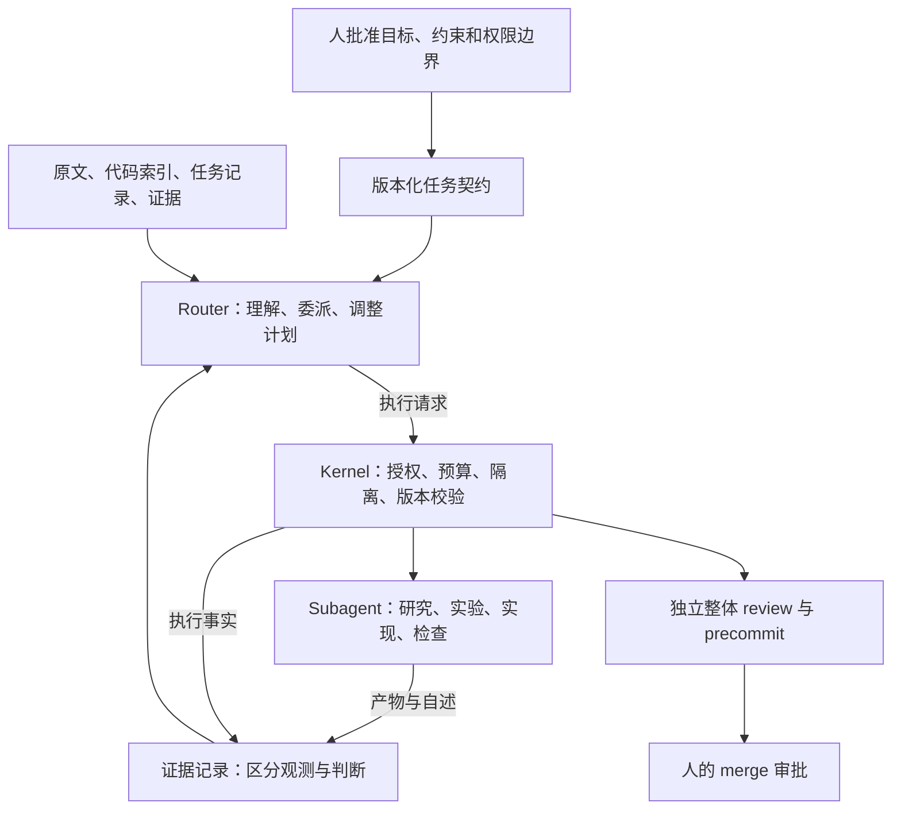

# Discovery：让 router 成为有执行边界的指导官

日期：2026-09-20。状态：设计探索，未批准、未实现；不替代现有 router-conductor spec。

后续用户已明确快速摘要 agent、router 不改 spec 而自主决定实现方式，以及完整升级的持续运行要求。冷启动实施交接请先读 [1-requirements.md](1-requirements.md)；本文保留探索过程，备选方案不覆盖后续需求。

## Seed Brief

用户以 `task-20260920-001` 为例提出：任务跨多个模块，router 却不读 spec 内容，只在少数固定角色之间调度。目标是让 router 能理解任务、主动调查、指导 subagent、调整执行方式，同时把安全约束交给工程机制强制执行。

这次探索讨论 conductor 的设计，不执行、批准或修改该 AMM 任务。安全需分别评价：执行有没有越权，交付有没有满足需求。两者不能用同一个“日志成功”代替。

未知：现有失败有多少来自信息不足、委派能力不足、单 maker 容量、spec 本身矛盾；多 agent 是否能在相同预算下改善最终结果。

## 当前事实

| 事实 | 代码或案卷依据 | 含义 |
| --- | --- | --- |
| router prompt 只含 brief、记录、内核事实，明确排除 spec/diff/代码 | `conductor/lib/prompts.mjs:80`；`conductor/stages/routing.mjs:83` | 这是当前架构约束，不是偶然漏传 |
| router 只有 Write，默认 4 turns | `conductor/lib/agent-settings.mjs:20`、`:34` | 不能主动补充上下文 |
| log 只有 action/packages/summary 等有限字段 | `conductor/lib/log-contract.mjs:27` | 没有正式的本轮任务目标、问题或交付要求 |
| maker 动作没有接收 router decision | `conductor/stages/routing.mjs:179`；`conductor/stages/actions/maker.mjs:49` | router 即便在理由里写了指导，下游也收不到 |
| P2b 工作包执行尚未接线 | `AGENTS.md`；`conductor/stages/routing.mjs:131` | 不能把 packagesEnabled 改成 true 当成已有能力 |
| 今日 spec 有 38 条 AC、7 个工作包、10 个待决问题 | `specs/task-20260920-001.md`；`dossier/task-20260920-001/spec-r1.log.json` | 仅把 spec 换成包状态仍会丢失决策信息 |
| 当前任务在 spec 人闸，尚未批准 | `state/queue/task-20260920-001/runtime.json`，本次读取时 | 后文执行案例都是候选方案 |
| merge 依赖当前 H 的 review、当前 H/B 的 precommit | `conductor/lib/version-gate.mjs` | 值得保留的工程基础 |

现有 router 仍可依据 brief、summary 和失败反馈做判断；它并非纯状态机。但输入、输出和执行能力共同限制了它的指导空间。

## Current Best Framing

让 router 对“下一步应解决什么问题、用什么证据判断、交给谁做”负责。kernel 对“这次执行有没有授权、结果属于哪个版本、能否进入集成与发布”负责。

自主性至少需要四种能力：获得原始上下文、表达具体委派、观察可追溯结果、根据新事实修改计划。并发只是其中一种执行选择。

状态机继续表达运行、等待人、失败收箱、完成等生命周期。具体研究和实施路径由 router 选择。有限的执行操作仍有价值：限制的是可产生的副作用，而不是预设一条开发顺序。

## 探索过的选择

| 选择 | 价值 | 主要风险 | 适合条件 |
| --- | --- | --- | --- |
| 单 maker，增加检查点与更好的上下文 | 改动少，协调成本低 | 大任务仍可能受上下文和执行时间限制 | 小任务或难以分解的任务；必须保留为对照组 |
| 仅让 router 读 spec | 改善问题识别 | 没有委派通道时，判断无法影响执行内容 | 验证信息是否是主要瓶颈 |
| 落地已有静态工作包方案 | 获得隔离与并行的执行基础 | 初始依赖可能错误；缺少调查与动态修订 | 目标清楚、接口稳定、拆分已验证 |
| 具体委派＋按证据修订计划 | 能先调查未知、局部修复、调整依赖 | 需要明确权限、产物、过期与集成语义 | 本次优先探索 |
| 长会话 supervisor，自由递归派 agent | 自然交互、潜在灵活度高 | 成本、权限继承、恢复与记录一致性更难约束 | 上述边界验证后再比较 |

## 建议入手的六个点

### 1. Router 能理解内容，并能回到原文

允许读取 spec、代码、diff 和执行证据。默认上下文提供目标、约束、未决问题、活动任务和必要摘要；需要时按章节、文件或产物引用读取原文。摘要是索引，不是唯一事实源。

router 的持久工作记忆至少区分：有来源的事实、当前假设、待回答的问题、活动任务与结果引用。不要把上轮总结自动升级为事实，也不必把全部历史每轮重放。

扩大阅读权限要限定可读项目与产物范围，避免把秘密加入上下文；文档中的文字不能改变 kernel 授权。只读能力和写入/执行能力分别管理。

### 2. 委派协议传达目的，角色提供权限模板

让 router 表达具体任务，例如：

> 验证 Ponder 在无 DATABASE_URL、无数据库、依赖已准备的环境中能否完成 codegen/build。记录版本、命令和失败原因；产出最小复现。只在临时实验目录操作，结果不直接并入产品。

一次委派至少说明目标或问题、输入引用、预期产物、退出条件和请求的能力档位。kernel 绑定任务身份、契约/输入版本、实际授予的权限与预算。

研究、诊断、接口设计、局部验证都可以是任务意图；不必每增加一种意图，就增加一个永久阶段。现有 spec/maker/reviewer 可作为起点，但权限档位必须按实际副作用定义。

worker 在授权责任范围内自主完成工作。完成、遇到新的关键未知、依赖失效或约束冲突时再返回 router；等待、超时、收集等机械操作由 kernel 处理。

### 3. 批准的契约稳定，执行计划可以调整

人批准目标、AC、明确的非目标、约束和允许的折衷。router 可以自主调整任务顺序、拆分、合并、责任分配和实现方法。

计划修改留版本和简短理由；只有受影响的运行任务需要等待、停止或隔离。旧产物进入新计划前校验输入与相关依赖；不凭完成时间自动采纳，也不因无关计划变化一律重做。

不要把 AC 分包当成“需求已经覆盖”的证明。探针可以不独占任何 AC；一条 AC 可以需要多个任务共同提供证据。所有原始 AC 仍进入最终整体验收。

内核能校验契约未被替换、权限未扩大、引用版本一致，不能完全机械判断“某个实现选择是否改变了需求含义”。允许隔离探索；明确改变产品承诺时返回 spec 审批，reviewer 始终按当前获批契约裁决。

### 4. 把子任务可用、集成成功、产品验收分开

这三种结论回答不同问题：

| 结论 | 回答的问题 |
| --- | --- |
| 子任务退出条件满足 | 这次调查有答案了吗？承诺的接口/产物可供下游使用了吗？ |
| 集成检查通过 | 这些产物能否在同一个候选版本中一起工作？ |
| 产品 AC 通过 | 最终整体行为是否满足获批需求？ |

本例 P-001 主责全仓构建测试，而其余包依赖 P-001。如果把全部 AC 通过作为启动下游条件，会形成循环。当前 P2b 并未实现这种循环；这是候选调度模型需要避免的陷阱。

共享文件也需要实际执行策略，例如 lockfile、根 package.json 的单一写入责任、串行更新或集中集成。声明文件不相交不能证明语义独立。初版用单写 worker 降低这一风险，之后再引入并行写入。

### 5. 工程化执行边界，独立检查验收证据

| 决策或事实 | 负责方 |
| --- | --- |
| 读什么、调查什么、谁先做、失败后怎么调整 | Router |
| 文件/网络/进程能力、预算、超时、执行身份、可信记录 | Kernel 与运行时 |
| 子任务实现细节 | 获得限定授权的 worker |
| 需求是否满足、测试是否能识别错误 | 独立 reviewer 与适当的验证程序 |
| 改变产品承诺、最终 merge | 人 |

本仓 maker 配置为全工具、Bash 免审批，`maker-git-guard.mjs` 主要检查命令文本中的 git 操作。它不等价于通用的文件、网络与进程隔离。本次未审计宿主 CLI 的完整隔离配置，不能据此宣称已有或没有系统级隔离。

执行配置应覆盖三种实际工作：静态只读、临时沙盒实验、候选代码修改。安装依赖、运行 codegen 或测试都可能写文件、联网和启动进程，不能因为“不改产品源码”就叫只读。

agent 自述、执行器观察、验收结论必须分开。可信的 exit 0 只证明特定命令成功退出，不能单独证明 AC 成立。关键测试由独立检查确认能识别反例，尤其注意 worker 可修改测试与脚本的情况。对需要证明无网络的行为，单个 fetch spy 不能替代覆盖相应进程的网络约束与观测。

保留现有 H/B 版本门；新委派产物还应绑定输入快照、契约版本和来源。最终整体 review/precommit 的放行资格由 kernel 核对，局部检查与 router 的满意判断都不能替代它。

所有受支持的子委派经同一授权入口：子权限只能收窄、预算计入父任务、停止能覆盖后代。第一版可不开放递归委派；但若声称不能绕行，就必须在运行时验证对子 CLI、脚本和原生 subagent 的限制，而非只写 prompt。

### 6. 先证明决策改善，再扩展并发

先对比以下三个决策回放版本：当前 router；只增加原文读取；原文读取＋具体委派＋证据反馈。

固定输入、预算和逐轮反馈，检查新事实是否真正改变后续任务。回放只证明调度表达与边界，不能证明真实实现质量；通过后再运行一条窄链。

评价要求：保留全部需求、正确识别影响范围、针对性调查而非盲重试、拒绝越权与过期产物、限制总成本。随后比较真实任务的返工量、遗漏、人工介入和完成时间，不以 subagent 数量作为成功指标。

## 用 task-20260920-001 做演练

下列是候选指导行为，未验证相关第三方能力或部署信息。

| 新信息或问题 | Router 应能做出的具体决策 |
| --- | --- |
| 部分部署地址尚未核实；safe default 允许 null，但 AC-008 要求地址有效 | 派地址核实任务，指出契约内的歧义；不把 null 静默当成通过。工具链可继续推进 |
| AC-025 要求 Ponder codegen/build 不依赖数据库 | 尽早在隔离临时目录跑最小探针；把依赖准备与离线构建分开。失败时定位受影响任务，不直接删除 AC |
| 前端依赖 API，API 又依赖适配器，但前端 fixture 驱动、API 为 501 骨架 | 验证 schema/路由契约稳定后，考虑组件与 API 骨架并行；不直接照抄初始依赖表 |
| 共用 schema 后续变化 | 识别受影响的 API、UI、适配器结果，补检查或重做；无关结果不自动作废 |
| worker 报完成，但给出的证据来自旧输入版本 | 保存产物用于诊断，拒绝直接作为当前版本验收依据 |

实际执行不应一次铺开七个包。可以先选无 DB 构建探针，验证“调查 → 结果影响计划 → 有边界的实施 → 独立检查”。完成后再用共用契约、API 骨架、fixture UI 验证并行与集成。

## Collision Rounds

### Round 1

- 初始 thesis：扩大 router 的阅读能力，以受限委派协议调度多个 worker，kernel 守权限与最终门。
- 最强反对：有七个包仍会有循环验收和错误依赖；读懂也不等于能表达指导；只增加 git hook 不能证明执行隔离；计划/范围的边界具有语义。
- 接受修订：把指导核心改成管理未知与证据；区分任务退出条件与最终 AC；显式增加委派通道；保留计划/范围判断的局限。
- 不采纳：没有得到足够理由继续禁止 router 阅读所有 spec/diff/代码；应按权限和上下文成本控制访问。
- 未决：最小委派模型是否已足够，安全边界如何真实落地。
- 下一轮：攻击递归执行、证据可信性、中央 router 成本和过度设计。

### Round 2

- 修订 thesis：证据驱动的指导官＋版本化委派＋独立验收；先单写 worker，配合研究/实验，再扩展并行写入。
- 新反对：实验不等于只读；exit 0 不等于 AC 通过；子 CLI 可能绕过委派账本；每个技术动作都经 router 会制造新的瓶颈。
- 接受修订：区分静态读取与沙盒实验；分离观测、自述、验收；明确递归授权与预算继承；worker 拥有一段责任范围的自主权。
- 不采纳：不把所有 AC 都升级成昂贵验证，也不把每个语义疑问都变成人工停车。关键证据优先加强，受影响的契约变更才进入审批。
- 剩余争点：运行时隔离选型、委派粒度、是否需要多写 worker，需要实际实验。
- 停止理由：challenger 接受修订方向，剩余分歧依赖运行证据；继续扩展概念容易提前建设完整调度平台。

## Accepted Revisions

- 自主性应体现为下一步任务随证据变化，而不是 agent 数量或自由文本长度。
- 工作包表是计划建议，需要验证依赖与共享资源；不能机械等同验收图。
- 放宽阅读和放宽执行权限是两个独立决定。
- 工程保证需要准确命名：能强制约束副作用和证据版本，无法保证 AI 永不误判需求。
- 保留已有案卷、预算、保险丝、人闸、版本门，逐步扩展其表达能力。

## Unresolved Disagreements

| 问题 | 候选选择 | 判断所需证据 |
| --- | --- | --- |
| Router 的上下文 | 全文为主 / 摘要索引＋按需读取 | 识别遗漏率、读错率、延迟与成本 |
| Supervisor 生命周期 | 持续会话 / 可恢复的逐轮调用 | 中断恢复、上下文漂移、开销 |
| 多写 worker 时机 | 早期加入 / 单写模式稳定后加入 | 并行收益能否覆盖冲突与整体复审成本 |
| 执行隔离方式 | 宿主已有沙盒 / 独立执行环境 | 文件、网络、进程和后代权限的可验证边界 |
| 验收强度 | 关键 AC 加强 / 广泛增加独立验证 | 实际漏检类别与验证成本 |

## Hidden Assumptions 与高风险方向

尚未证明：任务大就应并行；全文可读就能理解正确；拆分后上下文成本一定下降；给了来源就能避免错误解释；包文件互斥就不存在集成问题。

值得后续比较的方向：递归子指导官、局部结果缓存、增量 review、动态选模型。它们分别引入权限继承、过期结果、最终验收覆盖和模型能力判断的问题，不宜作为第一版前提。

## Feasibility Inputs 与推荐下一步

第一步为可回放的委派原型：原文按需读取、明确的任务目标/交付要求、带输入版本的产物引用、单写 worker 与受控实验能力。无需先建设通用 DAG 引擎。

在沙盒中注入错误权限请求、旧版本结果和虚假成功自述，验证 kernel 和最终门的处理；再以本例的一个未知跑真实闭环。契约矛盾先作为被发现的问题记录，不假设已经获批解决。

原型通过后再写正式 requirements/tech spec，明确修改当前 Invariant 2 的授权方式、委派契约、权限档位、恢复语义和并发策略。本文不作为实现授权或对已有任务的 spec 审批。

## 外部参考

- Anthropic 对 orchestrator-workers 的描述是动态分解、委派与合成结果；同时强调环境反馈与评估。这里仅作为架构参照，不能证明本仓多 agent 一定优于单 maker：[Building effective agents](https://www.anthropic.com/engineering/building-effective-agents)。
- 运行时边界可参考文件系统与网络隔离、对子进程实施约束的设计；具体机制仍需验证本机适用性：[Making Claude Code more secure and autonomous with sandboxing](https://www.anthropic.com/engineering/claude-code-sandboxing)。
