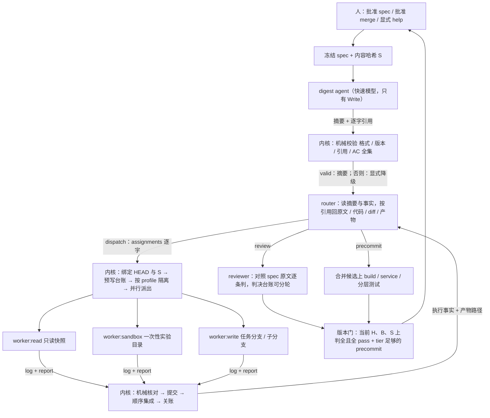

# 设计与操作：自主指导、可持续运行的 Loop Conductor

日期：2026-09-20。状态：已实现。需求见 [1-requirements.md](1-requirements.md)；探索过程见 [-1-discovery.md](-1-discovery.md)（其中的备选方案不覆盖本文）。事实源是代码与测试，本文只解释「为什么这么做、保证到哪一步、怎么操作」。

## 1. 一张图



三个结论严格分开：**子任务退出**（worker 的 log）≠ **集成成功**（台账 `integrated`）≠ **产品验收**（版本门）。

## 2. 关键设计取舍

| 问题 | 做法 | 为什么 |
| --- | --- | --- |
| spec 的「版本」是什么 | 正文的 sha256（`lib/spec-version.mjs`） | 草稿 → 冻结 → 归档，路径变三次内容不变；人改一个字则摘要、判决、委派全部按新版本重来。文件搬家不损坏引用。 |
| 摘要怎么保证可回原文 | 每条带 `{lines:[a,b], quote}`；内核校行号范围、quote 逐字出现在所引行、AC 索引与内核枚举逐条相等、每条 AC 的引用必须覆盖内核算出的该 AC 定义行（因此 AC 引用的 quote 可省）；另存该版本原文快照 `digest/<sha12>.source.md` | 全是机械判定，不需要内核理解自然语言。语义对不对机械校验看不出来——所以 router 的 prompt 明说「以原文为准」，reviewer 与人永远读原文。 |
| 摘要失败怎么办 | 会话内 Stop hook 快反馈（最多 3 次）+ 内核每个 spec 版本最多 `digestMaxAttempts` 次尝试（错误清单原样喂回）→ 用尽即**显式降级**：router prompt 写明「摘要不可用」并给原文路径；`conductor digest <id> --force` 可重做 | 不静默用过期 / 空 / 内核猜的摘要；任务不因摘要失败卡死。spec 闸前的那次触发不拦人审。 |
| router 怎么「读得懂」又不扩大权限 | 工具 `Read,Grep,Glob,Write`，没有 Bash；read-guard 把读范围收口在本任务的案卷 / spec / worktree 并拒读 `.env*` 等；write-guard 只放行它的 log 与 `router-notes.json`；diff 由内核物化成 `views/<head>.patch` | 读取能力与执行权限是两个独立决定。router 改不了 spec：它没有写 spec 的通道，委派给 worker 去改也会被机械核对还原并开 help 闸。 |
| router 的指导怎么到达执行者 | `dispatch` 的 `assignments[]`：`purpose / inputs / scope / deliverables / done_when` 五个文字字段**逐字**注入 worker prompt；`maker` 动作可带 `guidance` | 以前指导只活在一行路由理由里，下游收不到。 |
| 权限模板 | `profile`：`read`（无执行）/ `sandbox`（一次性实验目录，产物不并入产品）/ `write`（内核提交并集成）。`intent` 只是目的标签 | 按真实副作用分档：装依赖、跑测试、codegen 会写盘联网起进程，属于 sandbox 而不是 read。 |
| 并行与共享写入 | 同轮委派并行（`maxParallelAssignments`）；≥2 个 `write` 必须各自声明 `paths`，内核按字面前缀**保守**判重叠，重叠即拒（router 改成串行）；集成时真冲突 → `conflict`、`merge --abort`、分支保留、其余照常集成；声明范围外的改动只报告 | 并行度不是目标。声明不重叠不证明语义独立，那是 router 与整体 review 的事。 |
| 撞会话上限 | worker / maker **增量写 log**（`partial` + `done` / `remaining`）；已落盘的工作无条件提交；`truncated ∧ 有可核实进展 ∧ 额度内` → 内核自动 `claude -r <session>` 续会话（`maxAutoContinues`），否则台账标「可续接」交回 router（`continue_from`）；续不上则降级为带进度上下文的冷启动 | 大任务不能依赖一次会话恰好做完；也不该每次截断都花一轮 router。没有合格 log 时内核只写 `salvage.json`（观察到的事实 + 未知清单），outcome 留空。 |
| reviewer 判不完 | 判决增量写 `reviewer-r<n>.verdicts.json`；内核按 `(H, S)` 合并、对照全部 AC 算覆盖率；下一次 review 只判剩余；H 或 S 变了旧判决全部不算 | 短 log 2000 字符放不下 40+ 条 AC；不能为缩短输出漏判，也不能提前打开 merge 资格。 |
| 长任务不被误杀、死循环拖不过去 | 同签名连击保险丝照旧；新增**停滞保险丝**：每轮算硬进展指纹（代码 tree、review 覆盖、precommit 结论、人的裁决数、spec 版本），连续 `fuseStallRounds` 轮不变即收箱；另有 `maxRoundsPerTask` 与预算兜底 | 数进展不数轮数：每轮都在推进的 100 轮任务没事；换 key、改写报告、反复调研都改变不了指纹。 |
| 崩溃恢复 | 预写：轮次号先落盘、委派台账先于派出落盘、spawn 记录带 pid 身份（pid + 启动时刻）、merge 前写 `merge-intent.json`、入账金额写回 spawn 记录。重启时（`run` 启动巡检 + 每个 ROUTING 步开头）：收割仍活着的残留 agent（身份对得上才杀，pid 被复用不杀）→ 补记 interrupted + 成本未知 → 已落盘的工作提交 → 按 `merge-base --is-ancestor` 判断是否已集成（不重复集成）→ 关账 → 成本对账（只升不降）。恢复**不自动重派**任何 agent | 恢复依据是持久记录 + 实际状态，不是上一段进程的内存。要不要续、怎么续是 router 的判断。 |
| 持续运行 | `run --continuous`（跑到空闲 / 必须停下）、`run --watch`（空闲也不退出，轮询新工作）；运行账本 `state/.run-session.json` 跨批次累计，未收尾的账本被下一个进程接管 | 批次耗尽只是让出执行机会；新批次、新进程都不是新授权。正常收尾后人再次手动 `run` 才是。 |

## 3. 保证边界：哪些由程序强制，哪些靠模型判断

**程序强制（不依赖任何 agent 的自觉）**

- 无执行角色（router / digest / spec / reviewer / worker:read）没有 Bash：由宿主 CLI 的 `--tools` 保证（受控真实执行里核对过 init 事件的工具清单）。它们的写入只有白名单里的绝对路径（write-guard hook）；router 与 worker:read 的读取只在点名的根目录之内（read-guard hook）。
- 有执行角色（maker / worker:sandbox / worker:write）的工具集是显式白名单——真实 CLI 的「全工具集」里有 `Task`、`CronCreate`、`RemoteTrigger`、`SendMessage`、`ScheduleWakeup`、`Workflow` 等不入账、不受停止控制的旁路，现在一律不可见。递归委派本版不开放。
- 每次有执行能力的派出前后做**机械核对**（`lib/integrity.mjs`）：历史案卷、冻结 spec、人闸裁决、摘要、内核代码 / 配置 / prompt、目标仓 profile 被改被删 → 还原；凭空多出的、不属于本轮任何派出的案卷文件（伪造的别的角色记录）→ 隔离到 `quarantine/`；sandbox / read 轮次结束后任务分支 ref 必须原样，否则挪回。任何一条 → `boundary_violation` 事件 + 内核 help 闸。
- 获批 spec 的哈希每个 ROUTING 步与 merge 批准时各复核一次，对不上即停（`spec_tampered`）。
- 版本门（第 2 节）：merge 只认当前 `(H, B, S)` 上判全且全 pass 的整体 review + tier 足够的 precommit；批准时重算。
- 每一次 spawn（含 digest、每个 worker、自动续接、重试）都过同一个入口：任务预算、运行额度、平台限额短路、停止请求、全局并发槽位；成本全部计入同一任务。未知成本显式计数（`unknown_cost_spawns`）并按既有策略保守入账，不当成免费。
- 不 push、两道人闸、遗留任务只读：照旧（`no-push-grep`、`human-gates`、`legacy-compat` 测试执法）。

**不是隔离、只是尽力而为的**

- `maker-git-guard.mjs` 是**命令文本**护栏（git 破坏性操作、嵌套 `claude` CLI）。它拦得住顺手敲出来的危险命令，拦不住刻意绕行。
- 机械核对是**事后核对 + 还原**：保证越权写入不会悄悄生效，不保证它发生不了；对 runtime.json、正在写的当轮文件、案卷之外的任意路径没有覆盖。
- 真正的文件 / 网络 / 进程隔离只能由宿主运行时给：`workerSandbox.enabled=true` 会把 Claude Code 的 OS 沙盒（macOS Seatbelt / Linux bubblewrap；`allowUnsandboxedCommands=false`、`strictAllowlist`）写进该轮 settings，spawn 记录的 `isolation` 如实标 `os-sandbox` / `hooks-only` / `no-exec`。**默认不开**：各目标仓的工具链缓存（pnpm store、`~/.npm`…）与所需域名必须由人按仓配进 `allowWrite` / `allowedDomains`，内核不猜。

**仍然依赖模型判断的**

- 摘要的语义是否忠实（机械校验只保证格式、版本、引用真实存在、AC 不多不少）。
- router 的拆分、顺序、委派文字写得好不好；它的工作记忆里 `source` 是否真的支持那条 fact（内核只保证没有出处的进不了 `facts`）。
- 「某个实现选择有没有改变需求含义」——内核能保证 spec 字节未变、AC 全部进最终 review，不能机械判断语义漂移；这由独立 reviewer 对照原文与人的 merge 审批兜底。
- reviewer 每条判决对不对；worker 报告里的「事实」是不是事实（报告要求区分观察与推断，但内核不核对）。

## 4. 角色与额度配置（`conductor.config.json`）

单次会话上限**不是**任务容量：撞上限的会话留下增量 log 与已落盘的工作，下一轮续上。整任务的上限是 `budgetUsd`、`maxRoundsPerTask` 与两根保险丝。

| 键 | 现值 | 理由（以 `task-20260920-001` 的规模为参照：spec ≈ 40KB、AC×44、提议 7 个工作包） |
| --- | --- | --- |
| `models.digest` | `claude-haiku-4-5-20251001` | 摘要是压缩 + 索引，产物被逐条机械校验、不合格会退回；不需要最贵的模型。实测：18 条 AC 的 spec 一次通过 $0.19；本案例这份 44 条 AC / 40KB 的 spec（隔离副本）一次通过 $0.35、约 5.5 分钟。每个 spec 版本最多 3 次尝试，最坏约 $2。 |
| `models.worker` | `claude-opus-5` | 与 maker 同档；调查类委派若想省钱可另配更便宜的模型（目前所有 profile 共用一个键）。 |
| `maxTurns.router` | 40（原 4） | 要读摘要、按引用回原文、看报告再写委派与工作记忆；4 轮只够写一行 log。 |
| `maxTurns.digest` | 12 | 一次 Write + 最多 3 次 Stop hook 退回重写。 |
| `maxTurns.reviewer` | 60（原 40） | 44 条 AC 一轮大概率判不完——判不完不再是失败：台账续审。 |
| `maxTurns.workerRead / workerSandbox / workerWrite` | 60 / 120 / 150 | sandbox 要装依赖、等命令；write 与你现有的 `maker: 150` 对齐。 |
| `maxTurns.maker` | 150（你的现值，未动） | — |
| `maxParallelAssignments` | 3 | 本案例可并行的最多也就 P-002 / P-003 这类两三件；更多只会抢限额。 |
| `maxConcurrentSpawns` | 6 | 多任务 × 多 worker 共用的会话槽位。 |
| `maxAutoContinues` | 2 | 一个委派最多 3 段会话（≈450 turns）不经 router；再长说明委派该拆小。 |
| `maxStepsPerTask` | 20（未动） | 只是批次让出点；配合 `run --continuous` 不再需要人反复敲 run。 |
| `maxRoundsPerTask` | 300 | 每个 router 轮、每个 worker 会话、每次续接、每次 digest 各占一轮。7 个包 × 若干轮 + 调查 + 多轮 review，预计 60–150 轮；300 是失控兜底，不是目标。 |
| `fuseStallRounds` | 8 | 纯调研最多连续 8 个 router 轮没有任何硬进展。 |
| `routerRecordWindow` | 14 | 最近 14 条记录带 summary 全文，更早的只给索引行（原文可按名 Read）。 |
| `budgetUsd` | 150 | 2026-09-21 按用户要求从 100 调为 150；这是每个任务的预算，不是所有任务合计。用尽时任务进 `FAILED_BOX(budget_exhausted)`、案卷与分支原样保留，调整额度后 `retry` 可续上。派出前检查不能严格封顶正在执行的会话成本。 |
| `runBudgetUsd` | null（未动） | 想给一次 `run --watch` 设总额度时再填。 |
| `workerSandbox.enabled` | false | 公开配置保留可移植的关闭默认值；启用前按本机填写缓存路径、允许域名和秘密拒读路径。 |

### 沙盒配置放在哪里

**当前只有 conductor 全局配置**：修改本仓 `conductor.config.json` 的 `workerSandbox`，所有由这个 conductor 派出的 maker 与执行型 worker 共用它。当前没有从 `target-profiles/<repo>/setup-profile.json` 读取沙盒覆盖配置的实现，也不自动使用每个目标项目自行定义的沙盒规则。此前所说的「按仓配置」，指根据目标仓的实际需要填写全局配置，不表示已支持按项目切换。

配置项的含义：

- `enabled`：设为 `true` 才开启；公开配置默认仍为 `false`，配置本机权限后再开启。
- `allowWrite`：额外允许 Bash 写入的工具链缓存绝对路径。工作目录和系统临时目录默认可写，无需放开整个用户目录或全部项目。可用 `pnpm store path`、`npm config get cache` 查实际缓存位置，再只添加用到的目录。
- `allowedDomains`：允许 Bash 访问的域名；例如安装 npm 依赖需要 `registry.npmjs.org`。其他下载源、文档站或 RPC 按实际任务需要单独添加，不默认全部放行。
- `denyRead`：额外禁止 Bash 读取的秘密文件或目录路径，例如 SSH 密钥目录；它不是允许读取目录的清单。

先准备所需路径与域名，在临时目标仓验证安装、构建和测试，再投入实际任务。配置变化后重新启动 runner，使其加载新配置。多个目标仓权限需求不同时，当前不能靠在各自 profile 中加字段获得隔离；把所有需求合成全局并集会同时扩大每个执行者的权限。

这里的 OS 沙盒约束执行角色的 Bash。WebFetch / WebSearch 是另外的工具授权（`workerWebAccess`），内核自己运行的 precommit 也不由这段 worker 配置自动隔离；不能把该开关理解为整个 conductor 的所有行为都进入同一个沙盒。

## 5. 恢复与日常操作

```bash
npm run conductor -- run --continuous      # 推进到没有可执行的工作为止
npm run conductor -- run --watch           # 常驻：人批准 / retry / 新建任务后自己接着跑
npm run conductor -- stop [--now]          # 请它停下（--now 收割在飞的 agent；已落盘的工作保留）
npm run conductor -- show <id>             # 现在在干什么、卡在哪、为什么停、怎么继续、花了多少
npm run conductor -- recover --dry-run     # runner 崩了之后先看会恢复什么（不改任何东西）
npm run conductor -- run                   # 启动时自动恢复，再继续
```

| `show` 的阶段 | 含义 | 怎么继续 |
| --- | --- | --- |
| 运行中 / 等待结果 | runner 活着，判断角色 / 执行者在跑 | 等；要停用 `stop` |
| 可恢复中断 | 上一个 runner 退出时有事没收尾 | `conductor run`（先恢复再继续） |
| 待运行 | 可推进但没有 runner | `conductor run --continuous` |
| 等待资源 | 平台限额 / 运行额度 / 调度槽位 | 限额：到点后 `retry`（不自动续跑）；额度：再次 `run` 即新授权 |
| 等待人 | spec / merge / help 闸，或已暂停 | `approve` / `reject` / `resume` / `unpause` |
| 已终止 | 完成、放弃、预算 / 轮次用尽、保险丝 | 按 `show` 给出的条件调整后 `retry` |

## 6. `task-20260920-001` 的接续操作（升级交付后由你执行）

升级过程中没有触碰这个任务：它仍在 `AWAIT_HUMAN(spec)`，`specs/task-20260920-001.md`、人闸记录与目标仓 `example-target` 均未被修改；兼容行为是在夹具与隔离副本上验证的（`tests/integration/upgrade-compat.test.mjs`）。

1. 继续按你的节奏改 `specs/task-20260920-001.md`（你已经在闸上改过几版，当前内核枚举为 AC×44）。想先看摘要长什么样：`npm run conductor -- digest task-20260920-001`（Haiku，实测约 $0.35 / 5–6 分钟；你之后再改稿它会自动过期重做，所以不看也行——批准后的第一次 `run` 会自动补）。
2. `npm run conductor -- approve task-20260920-001 --notes "<对 10 个待决问题的裁决，逐条写>"`。notes 会逐字进 router 与每个执行者的 prompt；没裁决的待决问题，router 被要求不得把 safe default 当成已批准。
3. `npm run conductor -- run --watch`（或 `--continuous`）。第一步会按**最终获批内容**补齐摘要，然后 router 开始调度。
4. 随时 `npm run conductor -- show task-20260920-001` 或看板。预期会出现的人闸：router 认为需要产品裁决时的 help（例如「两条链的地址查不到」）、以及最后的 merge。
5. 预算 $150 用尽时任务会收箱并保留一切；调高 `budgetUsd` 后 `retry` 续上。

## 7. 已验证的故障场景与已知限制

**自动化测试覆盖（fake claude，真 git、真进程、真锁）**：第 4 节验收表的 12 个场景，见 `AGENTS.md` 的 Case 索引。其中崩溃恢复用的是真 SIGKILL：runner 被杀后残留 agent 进程组确实还活着，重启后确实被按 pid 身份收割。

**受控真实执行（真 Claude CLI 2.1.27x；全部在隔离根目录 + 临时 / 替身目标仓里，未动真实任务与 example-target；合计约 $3.0）**

| 验证 | 结果 |
| --- | --- |
| 端到端（router=Sonnet，其余 Haiku；$1.18）：brief → spec → 摘要 → spec 闸 → 批准 → `dispatch` 三个并行委派（sandbox 探针 + 两个声明路径不重叠的 write）→ 撞上限（故意把 workerWrite 设成 8 turns）→ 内核自动 `claude -r` 续会话 → 提交与集成 → 整体 review（判决台账 18/18）→ precommit → merge 闸 → 批准 → DONE | 通过。`run --continuous` 跨了两个调度批次没有人工介入；router 的委派、工作记忆、依据人审 notes 先派探针都符合预期；合并后的目标仓 `node --test` 13/13。 |
| 各角色实际拿到的工具（看 init 事件） | router / reviewer：`Glob,Grep,Read,Write`；digest：`Write`；worker：`Bash,Edit,Glob,Grep,NotebookEdit,Read,WebFetch,WebSearch,Write`——没有 `Task` / `Cron*` / `RemoteTrigger` 等。顺带发现：`--tools` 只认工具名，旧配置里的 `Bash(git …)` 写法从来没有给出过 Bash。 |
| read-guard / write-guard / 秘密拒读（router 档，$0.04） | 根目录外 Read 被拒；根内 Read 通过；`.env` 被拒、`.env.example` 通过；在允许目录里 Grep `API_SECRET` 只返回 `.env.example` 与源码、**没有** `.env` 的内容（`permissions.deny` 由宿主 CLI 执法）；白名单外 Write 被拒、自己的 log 通过。 |
| OS 沙盒（`workerSandbox.enabled`，两次探针共 $0.12） | headless + `--settings` 下生效：cwd 内写入通过；cwd 与系统临时目录之外的写入 `operation not permitted`；整个案卷目录、冻结 spec 的写入被 denyWrite 拦住（即使落在默认可写的临时目录里）；非白名单域名联网被拒；agent 用 Write 工具交付 log 不受影响。注意默认可写范围含系统临时目录。 |
| 真实残留进程的恢复 | 对正在跑真 claude 会话的 CLI 发 SIGKILL：子进程仍活着；活着的 runner 持锁时 `recover` 拒绝动手（正确）；runner 死后 `recover` 按 pid 身份收割该 claude 进程组，spawn 记录补记 interrupted + 成本未知，会话 id 从原始流找回。 |
| 本案例 spec 的摘要（隔离副本，真 Haiku） | 第一版固定 prompt：行号全对，但模型把长句「概括」进 quote，逐字核对不过（$0.72，机制按设计拒收）。据此收紧 prompt（quote 要短、逐字）并让 AC 引用的 quote 可省（定义行锚点更硬）后：44 条 AC、31 条约束、9 个待决问题（全部 `unresolved`）、7 个工作包（全部 `proposal`，依赖关系正确）一次通过，$0.35。随后在副本上批准 → 沿用摘要（不重做）→ router / worker 续跑，r1 历史与已花成本完整，真实目标仓零分支。 |

真实执行里抓到并已修的内核问题：hook 脚本路径曾按数据根（`cfg.root`）拼，`CONDUCTOR_ROOT` 指到别处时所有 hook 静默失效——现在跟内核代码走；有 result 事件的非零退出（撞上限）被误报成「no result event」；写下 `ok` 之后才撞上限的委派被误标「可续接」。

**没有验证、不要据此假设的**

- 「任意时刻崩溃都可恢复」没有被证明。验证过的边界是：worker 执行中、已落盘未提交、已提交未集成、已集成未关账、merge 已合并未归档、入账与 runtime 落盘之间（单测）。没有逐条验证的：precommit 执行中崩溃（候选 worktree 由下次 precommit 自清；服务进程由既有的残锁接管逻辑处理）、`approve` 写冻结稿与写 runtime 之间、磁盘写满 / 文件系统损坏。
- OS 沙盒：settings 的生成有单测，真实隔离效果做过两次受控探针（见上表），但**没有**在真实目标仓的完整工具链（pnpm / turbo / next build 等会写全局缓存、要联网的命令）上跑过；开之前要按仓配 `allowWrite` / `allowedDomains` 并自己试一轮。
- 预算是**派出前**的闸：一次会话本身可以超出剩余预算（上限由该角色的 maxTurns 与墙钟限制）；并行 worker 同时起跑时可能一起越过线。
- 自动续接依赖 CLI 的会话恢复；续不上会降级为冷启动（带进度上下文），那一次的上下文成本会更高。
- 停滞保险丝的「硬进展」不含报告内容：连续 `fuseStallRounds` 轮只做调研会被停下——这是有意的，必要时调大。
- 看板 / `show` 里的 router 计划与 facts 是它自己的记录，内核不核对其真实性；执行事实以委派台账与记录为准。
